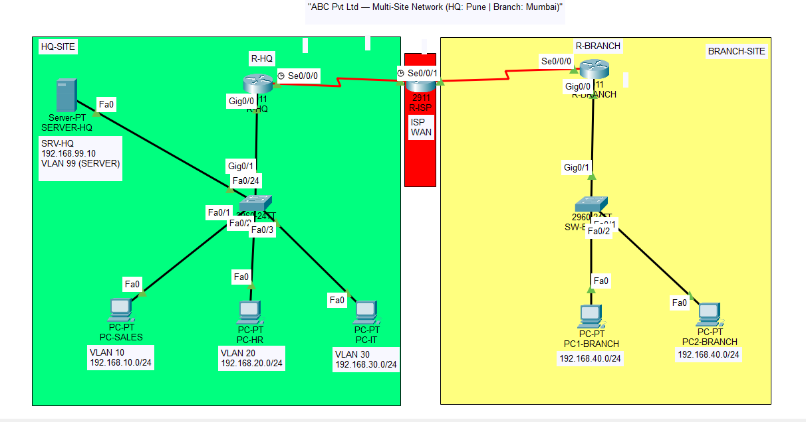

# Multi-Site Enterprise Network (Cisco Packet Tracer)

## Objective
Designed a 2-site enterprise network with department-level VLAN segmentation at HQ,
OSPF dynamic routing, DHCP services, a GRE tunnel providing a dedicated logical link
to the Branch office, and ACL-based restriction of Branch access to HQ resources.

## Topology

## Technologies Used
- VLANs + Router-on-a-Stick (inter-VLAN routing)
- OSPF dynamic routing across HQ, ISP, and Branch
- DHCP (per-VLAN scopes)
- GRE Tunnel between HQ and Branch
- Extended ACL restricting Branch-to-HQ traffic

## IP Addressing
IP Addressing Plan (VLSM)
Network                	VLAN	                    Subnet	                                        Gateway
Sales	                   10	                      192.168.10.0/24                                 	192.168.10.1
HR	                     20                      	192.168.20.0/24                                 	192.168.20.1
IT	                     30                     	192.168.30.0/24	                                  192.168.30.1
Branch LAN                _                       192.168.40.0/24	                                  192.168.40.1
HQ–ISP link	              _                      	100.64.0.0/30	                                          _
ISP–Branch link           _                       100.64.0.4/30	                                          _
Server                  	99	                      192.168.99.0/24	                                  192.168.99.1
GRE Tunnel	 	            _            172.16.0.0/30	R-HQ: .1 / R-BRANCH: .2

## Key Verification
- `show ip route` — OSPF routes learned across sites, including the tunnel subnet
- `show interfaces tunnel 0` — GRE tunnel up, traffic passing
- ACL tested: Branch blocked from Sales/HR, allowed to Server on HTTP only

## Challenges Faced
- Initially planned a site-to-site IPsec VPN, but Packet Tracer restricts crypto/ISAKMP
  commands on standard router images. Pivoted to a GRE tunnel, which achieves a
  dedicated logical link between sites (in production this would be paired with
  IPsec — GRE-over-IPsec — for encryption).
- Attempted to apply the security ACL directly on the tunnel interface, but Packet
  Tracer only supports the `ip address` command on tunnel interfaces — `ip access-group`
  is rejected. Resolved by applying the ACL on the physical LAN-facing interface
  (gig0/0, outbound direction) instead, since GRE traffic is decapsulated before
  being routed toward the LAN, so the ACL still correctly matches the inner IP
  addresses.

## Files
- `/screenshots` — verification screenshots
- `/configs` — full running-configs per device
- `topology.pkt` — Packet Tracer file
